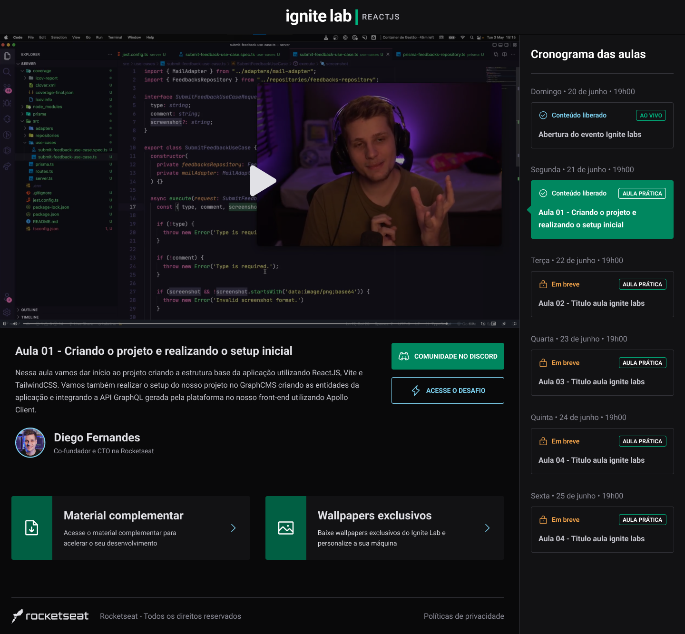

# event-platform

#### Projeto desenvolvido durante o evento Ignite Lab | React da Rocketseat

<h4 align="center"><a href="https://event-platform-eight.vercel.app/">Clique para visitar o projeto</a></h4>

## 🎯 Objetivo

Projeto desenvolvido através do Evento Ignite Lab da [Rockestseat](https://www.rocketseat.com.br/) com o objetivo de criar uma plataforma de aulas para o evento. Onde o usuário vai poder se cadastrar e ter acesso ao conteúdo das aulas.

## 🛠️ Tecnologias utilizadas

Para o desenvolvimento deste site utilizamos as seguintes tecnologias:

- React JS;
- Typescript;
- Vite;
- GraphCMS;
- Apollo Client;
- GraphQL Codegen;
- Tailwind CSS;
- Phosphor Icons;

## ⚙️ Funcionalidades

- ✔️ Um usuário pode se inscrever no "evento";
- ✔️ Todas as aulas podem ser listadas na barra lateral da página do evento;
- ✔️ Uma aula pode ser selecionada e assistida na página do evento;
